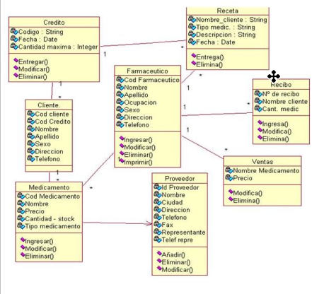
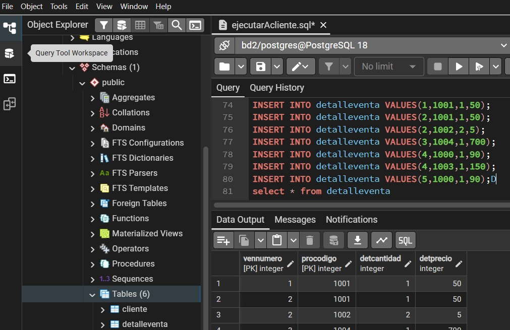
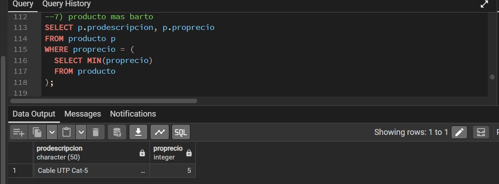

# Base De Datos 1 *(INF-312)*

En esta materia se utilizo los programas de;
>StarUML

>PostgreSQL

Para realizar las practicas de hacer DIAGRAMAS y sus relaciones con las demas tablas, tambien se practico muchos tipos de consultas.
En esta materia se vio los temas de:

- tipos de base de datos, (caracteristicas de algunas)
- Arquitectura de Sistema de Datos Datos
- DISEÑO CONCEPTUAL DE BASE DATOS BAJO UN MODELO ORIENTADO A OBJETOS(relaciones)
- Transformación del Modelo Orientado a Objetos al Modelo Relacional o Mapeo
- SQL(Lenguaje de consulta estructurado)

### diagrama entidad relacion

### practicas en posgreSQL (creando tablas)

### practicas en posgreSQL (haciendo consultas)

